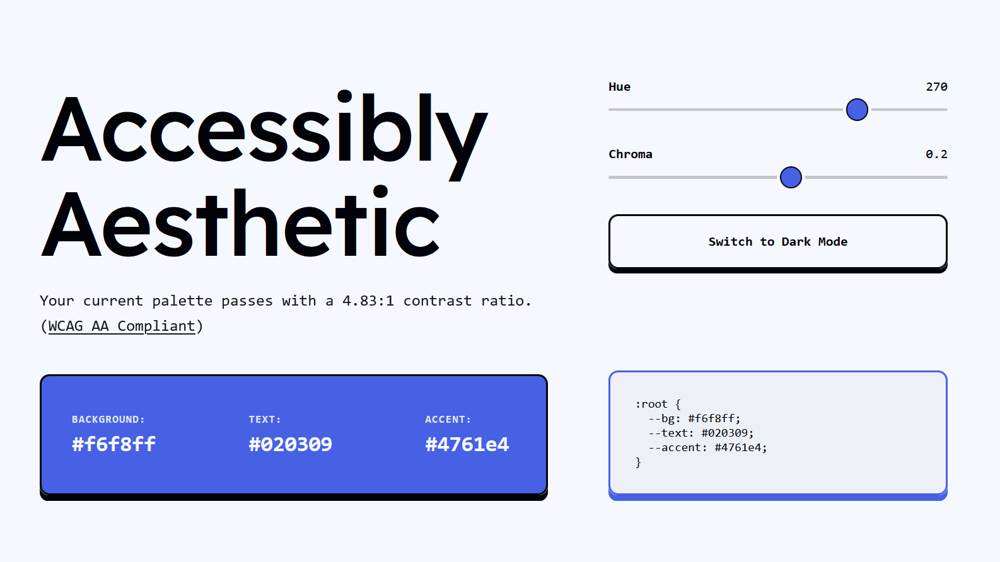

# Accessibly Aesthetic

**Accessibly Aesthetic** is a modern, web-based color palette generator designed to bridge the gap between visual appeal and accessibility standards.

 

## Live Demo
http://accessiblyaesthetic.xyz

## Features

-   **Real-time Color Generation:** Uses the **OKLCH** color space for perceptually uniform gradients and consistent lightness/chroma manipulation.
-   **Accessibility First:** Automatic WCAG 2.1 contrast ratio calculation with pass/fail grading (AA, AAA, Large Text).
-   **Light/Dark Mode Support:** On mode switch, opposite color palette gets generated.
-   **Developer Ready:** Generates copy-pasteable CSS variables.

## Tech Stack

-   **HTML5:** 
-   **CSS3:** 
-   **JavaScript**
-   **Culori:**

